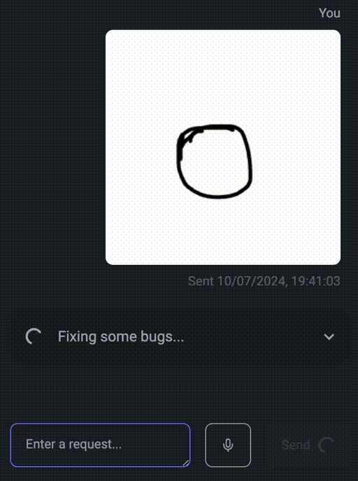

<div align="center">
  
  <br />
  <h1>ClaudeCAD</h1>
  <p>Your 3D print modeling assistant - making 3D modeling accessible to everyone.</p>
</div>

<div align="center">
  
  &nbsp;
  &nbsp;
  &nbsp;
  
  &nbsp;
  &nbsp;
  &nbsp;
  
</div>

## Try it out

Link to [demo](https://claudecad.com). **NB! The demo requires an Anthropic API key.**

Or scan this QR code to use it on your mobile device:

[](https://claudecad.com)

## Run locally

```bash
npm install # Install dependencies
npm run dev # Run the app in development mode
```

## Features

You can draw to create:


You can draw on the output to give feedback:


And use just text:


When an error occurs, it will attempt to solve it:



However, if it cannot solve the error, you can just say try again, and it will try even more things.

Other features:

- Using normal maps to make Claude understand the model from different angles.
- You can use voice to write in the input fields, making it easier to use it on a mobile device.
- Download an .stl-file of any of the models that can be printed out using a 3D printer.
- Use different colors in the drawings to enable adding measurements and other notes about the model.
  - E.g. add a green line and say it is 10cm long.
