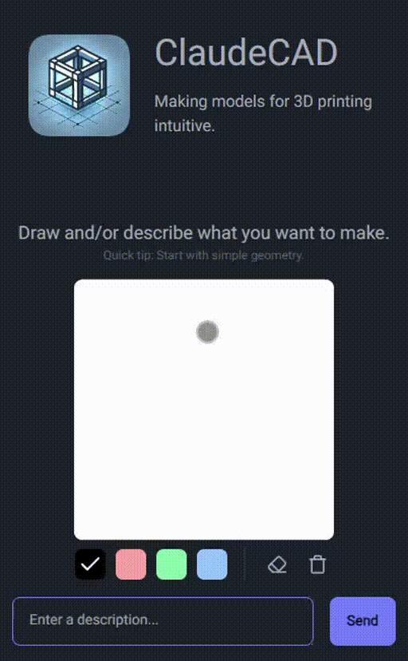
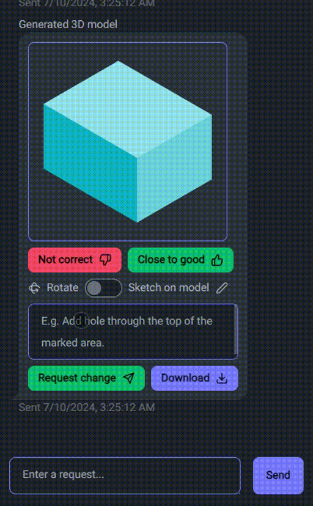
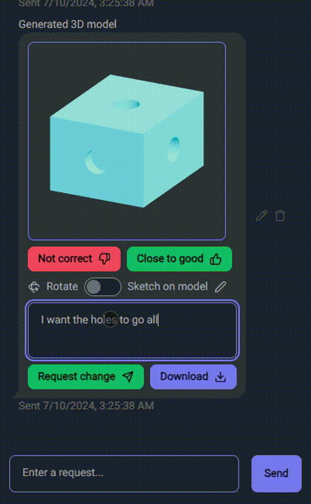

<div align="center">
  
  <br />
  <h1>ClaudeCAD</h1>
  <p>Your 3D print modeling assistant - making 3D modeling accessible to everyone.</p>
</div>

<div align="center">
  
  &nbsp;
  &nbsp;
  &nbsp;
  
  &nbsp;
  &nbsp;
  &nbsp;
  
</div>

## Try it out

Link to [demo](https://claudecad.com). **Requires an Anthropic API key.**

## Run locally

```bash
npm install # Install dependencies
npm run dev # Run the app in development mode
```
